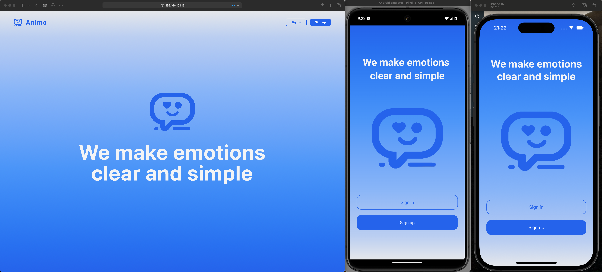
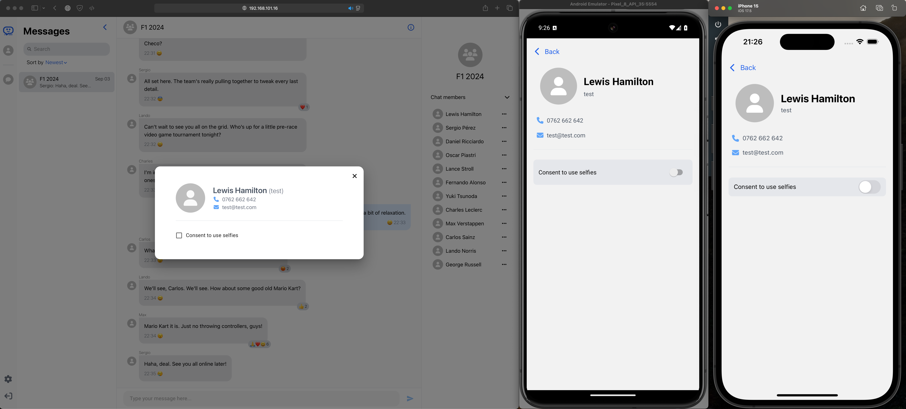
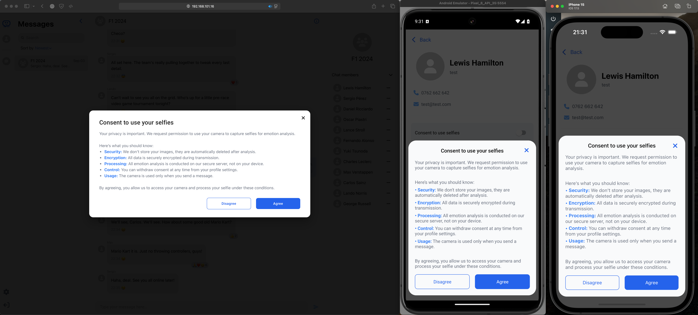
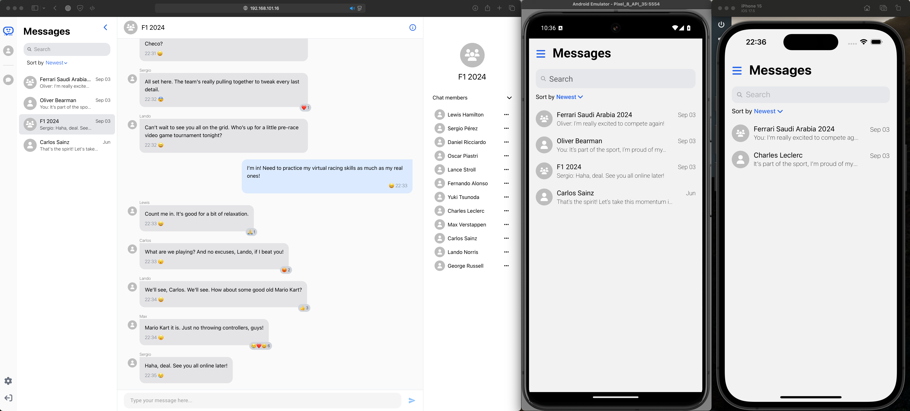

# Animo: Web and Mobile Messaging App with AI Emotion Analysis

Animo is a cross platform messaging app designed to change online communication by integrating AI for emotion analysis. Its core features allow users to send messages, create group chats, and share selfies, with AI analyzing and displaying emotional states to improve understanding in conversations.

Demo: [Animo: Web and Mobile Messaging App with AI Emotion Analysis](https://youtu.be/P04D65B8hx4)

## Tech Stack

- Web: [React](https://react.dev), [Vite](https://vitejs.dev), [TypeScript](https://www.typescriptlang.org), [Tailwind](https://tailwindcss.com)
- Mobile: [React Native](https://reactnative.dev), [TypeScript](https://www.typescriptlang.org)
- Backend: [ASP.NET Core](https://dotnet.microsoft.com/en-us/apps/aspnet)
- Microservices: [Flask](https://flask.palletsprojects.com/en/3.0.x/)
- AI Facial Emotion Analysis: [MediaPipe](https://ai.google.dev/edge/mediapipe/solutions/guide), [OpenCV](https://opencv.org/get-started/), [Scikit-learn](https://scikit-learn.org/stable/)

## Pages

- **Landing:**\
  

- **Login:**\
  

- **Register:**\
  

- **User Profile:**\
  

- **Selfie Consent:**\
  

- **Chats List:**\
  

- **Chat:**\
  

- **Chat Members:**\
  

## Key Features

- **Message Emotions:**\
  

- **Message Reactions:**\
  .gif>)
  

## App Logic

- **App Architecture:**\
  

- **API Architecture:**\
  

- **Microservice Architecture:**\
  

- **Database Architecture:**\
  
