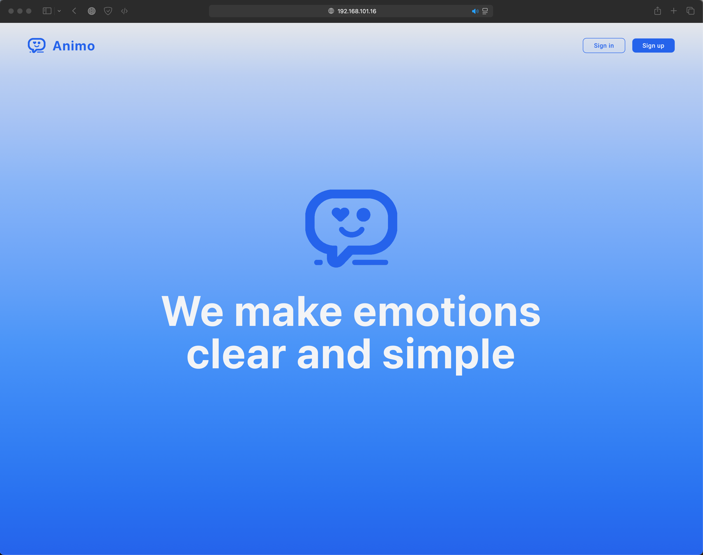
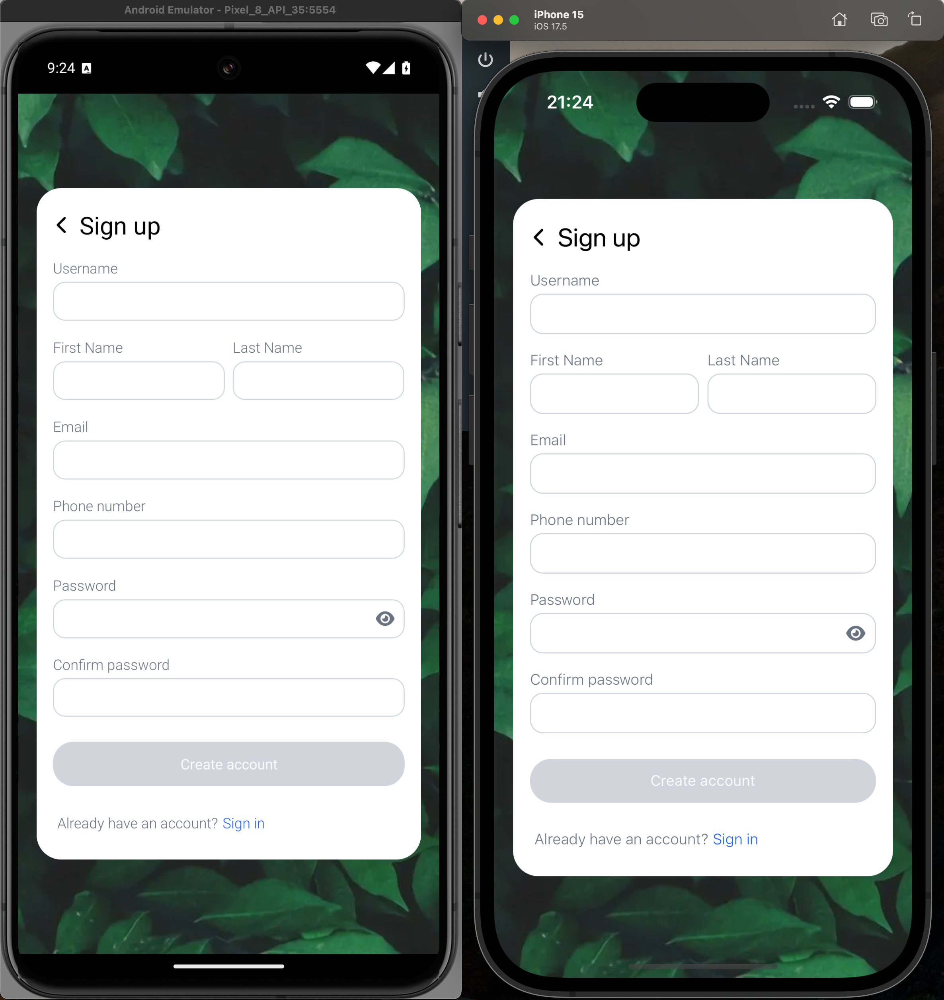
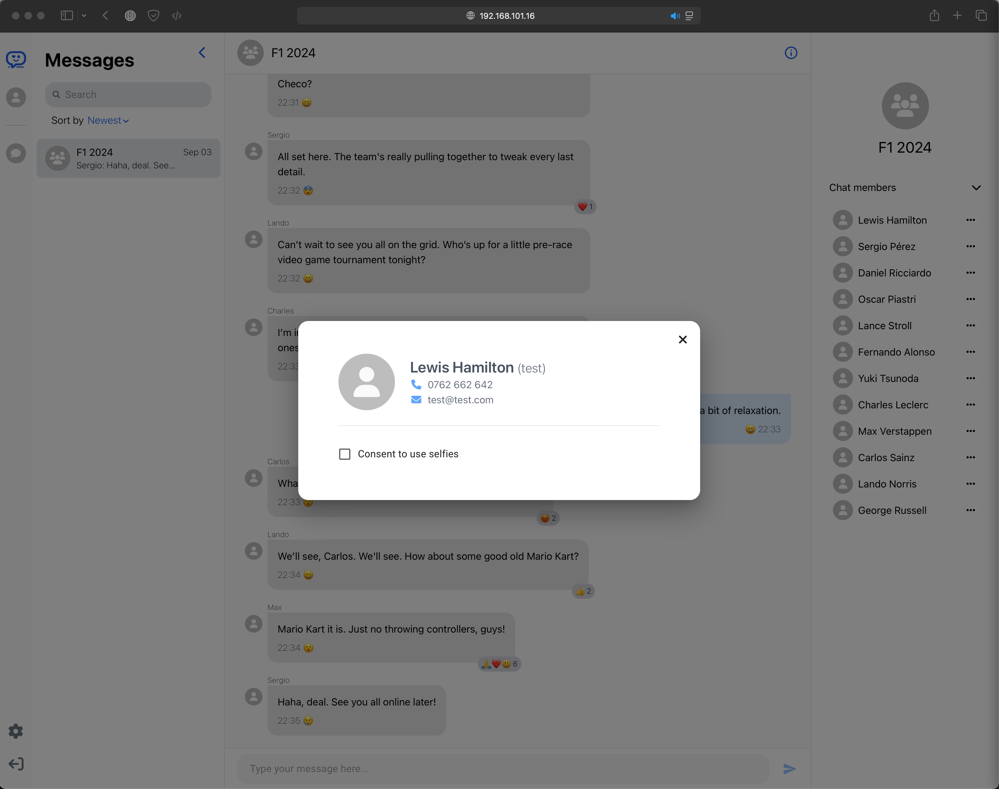

# Animo: Web and Mobile Messaging App with AI Emotion Analysis

Animo is a cross platform messaging app designed to change online communication by integrating AI for emotion analysis. Its core features allow users to send messages, create group chats, and share selfies, with AI analyzing and displaying emotional states to improve understanding in conversations.

  
  Demo: <a href="https://youtu.be/P04D65B8hx4">Animo: Web and Mobile Messaging App with AI Emotion Analysis</a>

## Tech Stack

- Web: [React](https://react.dev), [Vite](https://vitejs.dev), [TypeScript](https://www.typescriptlang.org), [Tailwind](https://tailwindcss.com)
- Mobile: [React Native](https://reactnative.dev), [TypeScript](https://www.typescriptlang.org)
- Backend: [ASP.NET Core](https://dotnet.microsoft.com/en-us/apps/aspnet)
- Microservices: [Flask](https://flask.palletsprojects.com/en/3.0.x/)
- AI Facial Emotion Analysis: [MediaPipe](https://ai.google.dev/edge/mediapipe/solutions/guide), [OpenCV](https://opencv.org/get-started/), [Scikit-learn](https://scikit-learn.org/stable/)

	<code></code>
	<code></code>
	<code></code>
	<code></code>
	<code></code>
	<code></code>
	<code></code>
	<code></code>
	<code></code>

## Pages

- **Landing:** A welcoming page that introduces users to Animo’s core features and provides access to login and registration.

  
  

- **Login:** Allows existing users to sign into their accounts.

  
  

- **Register:** Enables new users to create an account by providing essential details.

  
  

- **User Profile:** Displays user information such as name, username, phone number, email and selfie consent status.

  
  

- **Selfie Consent:** Asks users for consent to capture and analyze their selfies for emotion detection during chats.

  
  

- **Chats List:** Lists all ongoing and past chats, allowing users to quickly access their conversations. In the web version, the selected chat is also displayed with its messages and members

  
  

- **Chat:** A real-time messaging interface where AI-based emotional insights and reactions are displayed alongside messages.

  

- **Chat Members:** Shows the participants of the current chat.

  

## Key Features

- **Create Chat:** Quickly create new group or individual chats by selecting users from a search list.

  

- **Message Emotions:** Analyzes the emotion behind each message in real-time, using AI to display mood indicators like joy, anger, or surprise. This feature leverages the MoodScanner microservice to analyze facial emotions from user selfies and Rapid API for contextual emotion analysis based on message inputs.

  

- **Message Reactions:** Users can react to messages with emojis in real time. A dedicated reactions list shows the emojis used and the users who reacted.

  .gif>)
  

## App Logic

- **App Architecture:** An overview of the structure connecting the front-end and back-end components, detailing how messages and emotions are processed.

  

- **API Architecture:** The API architecture is centered around the API Controller, which uses various backend services. Key components include SignalR Hubs for real-time communication, Emotions Controller for emotion analysis, and feature-specific services for managing chat rooms, messages, and user reactions.\
  

- **MoodScanner Microservice Architecture:** A specific microservice responsible for analyzing selfies to generate emotion data.

  

- **Database Architecture:** The relational database schema that manages user profiles, chats, messages, and more.

  

## Author

  
  

